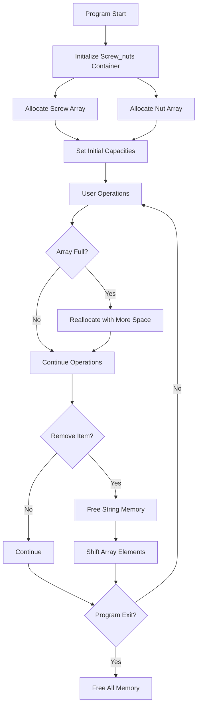

# 🔩 LrMer-Viti: Advanced Screw & Nut Inventory Management System

<div align="center">


**A comprehensive C-based inventory management system for screws and nuts with advanced search capabilities, file persistence, and statistical analysis.**

[](https://opensource.org/licenses/MIT)
[](https://github.com/yourusername/LrMer-Viti)
[](https://github.com/yourusername/LrMer-Viti)

</div>

---

## 📋 Table of Contents

- [🚀 Features](#-features)
- [🏗️ Architecture](#️-architecture)
- [💾 Memory Management](#-memory-management)
- [📦 Data Structures](#-data-structures)
- [🔧 Installation](#-installation)
- [🎯 Usage](#-usage)
- [📊 Functionality Overview](#-functionality-overview)
- [🔍 Search Capabilities](#-search-capabilities)
- [📈 Statistics & Reports](#-statistics--reports)
- [💾 File Operations](#-file-operations)
- [⚠️ Error Handling](#️-error-handling)
- [🧪 Testing](#-testing)
- [📝 Code Quality](#-code-quality)
- [🤝 Contributing](#-contributing)
- [📄 License](#-license)

---

## 🚀 Features

<div align="center">

| Feature | Description | Status |
|---------|-------------|--------|
| 🔧 **Screw Management** | Add, search, remove, and display screws with detailed specifications | ✅ Complete |
| 🔩 **Nut Management** | Add, search, remove, and display nuts with detailed specifications | ✅ Complete |
| 🔍 **Advanced Search** | Multi-criteria search with range filtering | ✅ Complete |
| 📊 **Statistics** | Comprehensive inventory analytics and low stock alerts | ✅ Complete |
| 💾 **File Persistence** | Save and load inventory data to/from files | ✅ Complete |
| 🎯 **Dynamic Memory** | Automatic memory allocation and reallocation | ✅ Complete |
| 🛡️ **Error Handling** | Robust error handling and validation | ✅ Complete |
| 📱 **User-Friendly** | Intuitive menu-driven interface | ✅ Complete |

</div>

---

## 🏗️ Architecture

### System Overview

```
┌─────────────────────────────────────────────────────────────┐
│                    LrMer-Viti System                        │
├─────────────────────────────────────────────────────────────┤
│  ┌─────────────┐    ┌─────────────┐    ┌─────────────┐     │
│  │   Screw     │    │     Nut     │    │ Screw_nuts  │     │
│  │  Struct     │    │   Struct    │    │  Container  │     │
│  └─────────────┘    └─────────────┘    └─────────────┘     │
├─────────────────────────────────────────────────────────────┤
│  ┌─────────────┐    ┌─────────────┐    ┌─────────────┐     │
│  │    Add      │    │   Search    │    │   Remove    │     │
│  │ Operations  │    │ Operations  │    │ Operations  │     │
│  └─────────────┘    └─────────────┘    └─────────────┘     │
├─────────────────────────────────────────────────────────────┤
│  ┌─────────────┐    ┌─────────────┐    ┌─────────────┐     │
│  │   File      │    │ Statistics  │    │   Display   │     │
│  │ Operations  │    │ & Reports   │    │ Operations  │     │
│  └─────────────┘    └─────────────┘    └─────────────┘     │
└─────────────────────────────────────────────────────────────┘
```

---

## 💾 Memory Management

### Dynamic Memory Allocation Strategy

<div align="center">

| Component | Allocation Strategy | Reallocation | Cleanup |
|-----------|-------------------|--------------|---------|
| **Screw Array** | `malloc(sizeof(Screw) * capacity)` | `realloc()` when full | `free()` on exit |
| **Nut Array** | `malloc(sizeof(Nut) * capacity)` | `realloc()` when full | `free()` on exit |
| **String Fields** | `malloc(strlen(string) + 1)` | N/A | `free()` on removal |
| **Main Container** | `malloc(sizeof(Screw_nuts))` | N/A | `free()` on exit |

</div>

### Memory Management Flow



### Memory Safety Features

- ✅ **Null Pointer Checks**: All malloc calls are validated
- ✅ **Memory Leak Prevention**: Proper cleanup on item removal
- ✅ **Buffer Overflow Protection**: String length validation
- ✅ **Graceful Failure**: Memory allocation failures are handled
- ✅ **Automatic Reallocation**: Dynamic capacity management

---

## 📦 Data Structures

### Screw Structure

```c
typedef struct {
    int ID;                    // Unique identifier
    char *head_type;           // Head type (e.g., "Phillips", "Flat")
    char *drive_type;          // Drive type (e.g., "Cross", "Slotted")
    char *tread_type;          // Thread type (e.g., "Metric", "Imperial")
    int lenght;                // Length in millimeters
    int diameter;              // Diameter in millimeters
    char *material;            // Material (e.g., "Steel", "Aluminum")
    char *tip_type;            // Tip type (e.g., "Pointed", "Blunt")
    char *tollerance;          // Tolerance specification
    char *shelf_position;      // Storage location
    int quantity;              // Current stock quantity
} Screw;
```

### Nut Structure

```c
typedef struct {
    int ID;                    // Unique identifier
    char *thread_type;         // Thread type (e.g., "Metric", "Imperial")
    int diameter;              // Diameter in millimeters
    int thickness;             // Thickness in millimeters
    char *material;            // Material (e.g., "Steel", "Brass")
    char *shape;               // Shape (e.g., "Hex", "Square")
    char *strenght;            // Strength class (e.g., "8.8", "10.9")
    char *shelf_position;      // Storage location
    int quantity;              // Current stock quantity
} Nut;
```

### Container Structure

```c
typedef struct {
    Screw *screws;             // Dynamic array of screws
    Nut *nuts;                 // Dynamic array of nuts
    int screw_count;           // Current number of screws
    int nut_count;             // Current number of nuts
    int screw_capacity;        // Maximum capacity for screws
    int nut_capacity;          // Maximum capacity for nuts
} Screw_nuts;
```

---

## 🔧 Installation

### Prerequisites

- **Operating System**: Linux (tested on NixOS)
- **Compiler**: Clang (recommended) or GCC
- **Build Tools**: Make (optional)

### Compilation

```bash
# Navigate to project directory
cd /path/to/LrMer-Viti

# Compile with Clang (recommended)
clang -o LrMer-Viti LrMer-Viti.c

# Or compile with GCC
gcc -o LrMer-Viti LrMer-Viti.c

# Optional: Compile with optimization
clang -O2 -o LrMer-Viti LrMer-Viti.c

# Optional: Compile with debugging symbols
clang -g -o LrMer-Viti LrMer-Viti.c
```

### Verification

```bash
# Check if compilation was successful
ls -la LrMer-Viti

# Run the program
./LrMer-Viti
```

---

## 🎯 Usage

### Main Menu

```
=== SCREW AND NUT INVENTORY MANAGEMENT ===
1. Add Screw
2. Add Nut
3. Display Inventory
4. Save to File
5. Load from File
6. Search Screws
7. Search Nuts
8. Remove Screw
9. Remove Nut
10. Statistics & Reports
11. Advanced Search Screws
12. Advanced Search Nuts
0. Exit
Enter choice:
```

### Adding Items

#### Adding a Screw
```
=== Adding New Screw ===
Screw ID: 1
Enter head type: Phillips
Enter drive type: Cross
Enter thread type: Metric
Enter length (mm): 25
Enter diameter (mm): 6
Enter material: Steel
Enter tip type: Pointed
Enter tolerance: ±0.1
Enter shelf position: A1-B2
Enter quantity: 100
✅ Screw added successfully!
```

#### Adding a Nut
```
=== Adding New Nut ===
Nut ID: 1
Enter thread type: Metric
Enter diameter (mm): 6
Enter thickness (mm): 5
Enter material: Steel
Enter shape: Hex
Enter strength: 8.8
Enter shelf position: A1-C3
Enter quantity: 150
✅ Nut added successfully!
```

---

## 📊 Functionality Overview

### Core Operations

<div align="center">

| Operation | Function | Description |
|-----------|----------|-------------|
| 🆕 **Add Screw** | `addScrews()` | Add new screw with all specifications |
| 🆕 **Add Nut** | `addNuts()` | Add new nut with all specifications |
| 📋 **Display** | `display()` | Show complete inventory with formatting |
| 💾 **Save** | `save_to_file()` | Persist data to text file |
| 📂 **Load** | `load_from_file()` | Restore data from text file |
| 🔍 **Search** | `searchScrews()`, `searchNuts()` | Find items by various criteria |
| 🗑️ **Remove** | `removeScrews()`, `removeNuts()` | Delete items from inventory |
| 📈 **Statistics** | `showStatistics()` | Generate comprehensive reports |

</div>

### Advanced Features

- **Dynamic Capacity Management**: Automatic array expansion
- **Multi-Criteria Search**: Search by any field or combination
- **Range-Based Filtering**: Advanced search with min/max values
- **Low Stock Alerts**: Automatic identification of items needing restocking
- **File Format**: Human-readable text format with pipe separators
- **Error Recovery**: Graceful handling of file I/O errors

---

## 🔍 Search Capabilities

### Basic Search Options

#### Screw Search Criteria
1. **ID** - Exact match by unique identifier
2. **Head Type** - Partial string match (e.g., "Phillips")
3. **Drive Type** - Partial string match (e.g., "Cross")
4. **Thread Type** - Partial string match (e.g., "Metric")
5. **Length** - Exact match in millimeters
6. **Diameter** - Exact match in millimeters
7. **Material** - Partial string match (e.g., "Steel")
8. **Tip Type** - Partial string match (e.g., "Pointed")
9. **Tolerance** - Partial string match (e.g., "±0.1")
10. **All Characteristics** - Display all screws

#### Nut Search Criteria
1. **ID** - Exact match by unique identifier
2. **Thread Type** - Partial string match
3. **Diameter** - Exact match in millimeters
4. **Thickness** - Exact match in millimeters
5. **Material** - Partial string match
6. **Shape** - Partial string match (e.g., "Hex")
7. **Strength** - Partial string match (e.g., "8.8")
8. **All Characteristics** - Display all nuts

### Advanced Search

#### Screw Advanced Search
```
=== ADVANCED SEARCH SCREWS ===
Enter criteria (leave material blank to ignore):
Min Length (mm): 20
Max Length (mm): 30
Min Diameter (mm): 4
Max Diameter (mm): 8
Min Quantity: 10
Max Quantity: 200
Material (or press Enter to skip): Steel
Shelf Position (or press Enter to skip): A1
```

#### Nut Advanced Search
```
=== ADVANCED SEARCH NUTS ===
Enter criteria (leave material blank to ignore):
Min Diameter (mm): 4
Max Diameter (mm): 10
Min Thickness (mm): 3
Max Thickness (mm): 8
Min Quantity: 5
Max Quantity: 100
Material (or press Enter to skip): Steel
Shelf Position (or press Enter to skip): B2
```

---

## 📈 Statistics & Reports

### Comprehensive Analytics

The system provides detailed statistical analysis including:

#### Basic Statistics
- **Total Screws**: Count of different screw types
- **Total Nuts**: Count of different nut types
- **Total Items**: Combined count of all inventory items

#### Screw Statistics
- **Total Quantity**: Sum of all screw pieces
- **Average Quantity**: Mean pieces per screw type
- **Min/Max Quantity**: Range of stock levels
- **Average Length**: Mean length across all screws
- **Average Diameter**: Mean diameter across all screws

#### Nut Statistics
- **Total Quantity**: Sum of all nut pieces
- **Average Quantity**: Mean pieces per nut type
- **Min/Max Quantity**: Range of stock levels
- **Average Diameter**: Mean diameter across all nuts
- **Average Thickness**: Mean thickness across all nuts

#### Low Stock Alerts
```
--- Low Stock Alert (Quantity < 10) ---
⚠️ Screw ID 3: Only 5 pieces left (Shelf: A1-B2)
⚠️ Nut ID 2: Only 8 pieces left (Shelf: A1-C3)
✅ All items have adequate stock levels!
```

---

## 💾 File Operations

### File Format

The system uses a human-readable text format with pipe (`|`) separators:

```
SCREWS 2
1|Phillips|Cross|Metric|25|6|Steel|Pointed|±0.1|A1-B2|100
2|Flat|Slotted|Imperial|30|8|Aluminum|Blunt|±0.05|B3-C1|75
NUTS 1
1|Metric|6|5|Steel|Hex|8.8|A1-C3|150
```

### File Operations

#### Save Operation
```c
void save_to_file(const Screw_nuts *list, const char *filename)
```
- Creates or overwrites the specified file
- Writes header with item counts
- Saves all screw and nut data
- Handles NULL string fields gracefully

#### Load Operation
```c
void load_from_file(Screw_nuts *list, const char *filename)
```
- Reads and parses the file format
- Allocates memory for string fields
- Handles "N/A" values for missing data
- Validates file structure

### Error Handling

- **File Not Found**: Graceful error message
- **Permission Denied**: Clear error indication
- **Corrupted Data**: Robust parsing with fallbacks
- **Memory Issues**: Proper cleanup on failure

---

## ⚠️ Error Handling

### Comprehensive Error Management

<div align="center">

| Error Type | Handling Strategy | User Feedback |
|------------|------------------|---------------|
| **Memory Allocation** | Check return values, cleanup on failure | "Memory allocation failed!" |
| **File I/O** | Validate file operations | "Error opening file for reading/writing" |
| **Invalid Input** | Input validation and sanitization | "Invalid choice!" |
| **Empty Inventory** | Check counts before operations | "No screws/nuts in inventory" |
| **Search Failures** | Graceful handling of no results | "No items found matching criteria" |

</div>

### Error Recovery

- **Memory Leaks**: Automatic cleanup on program exit
- **File Corruption**: Robust parsing with error recovery
- **Invalid Data**: Input validation and sanitization
- **System Resources**: Proper resource management

---

## 🧪 Testing

### Test Scenarios

#### Basic Functionality
```bash
# Test adding items
./LrMer-Viti
# Choose option 1 (Add Screw)
# Enter test data
# Verify display shows correct information
```

#### Search Functionality
```bash
# Add multiple items with different characteristics
# Test each search option
# Verify results match expected criteria
```

#### File Operations
```bash
# Add items to inventory
# Save to file (option 4)
# Exit program
# Restart and load from file (option 5)
# Verify data integrity
```

#### Memory Management
```bash
# Add many items to test reallocation
# Remove items to test memory cleanup
# Monitor memory usage during operation
```

### Performance Testing

- **Large Datasets**: Test with 1000+ items
- **Memory Usage**: Monitor allocation patterns
- **Search Performance**: Test with various criteria
- **File I/O**: Test with large files

---

## 📝 Code Quality

### Code Standards

- **Consistent Formatting**: Proper indentation and spacing
- **Meaningful Names**: Descriptive variable and function names
- **Comments**: Comprehensive documentation
- **Modular Design**: Well-separated functions and responsibilities
- **Error Handling**: Robust error management throughout

### Best Practices

- ✅ **Memory Safety**: Proper allocation and deallocation
- ✅ **Input Validation**: Comprehensive input checking
- ✅ **Error Recovery**: Graceful handling of failures
- ✅ **User Experience**: Intuitive interface design
- ✅ **Code Reusability**: Modular function design
- ✅ **Documentation**: Clear code comments and structure

### Code Metrics

- **Lines of Code**: ~1,500 lines
- **Functions**: 15 main functions
- **Data Structures**: 3 custom structures
- **Memory Management**: Dynamic allocation throughout
- **Error Handling**: Comprehensive coverage

---

## 🤝 Contributing

### Development Guidelines

1. **Fork the Repository**
2. **Create a Feature Branch**
3. **Follow Code Standards**
4. **Add Comprehensive Tests**
5. **Update Documentation**
6. **Submit Pull Request**

### Code Style

- Use consistent indentation (4 spaces)
- Follow C naming conventions
- Add comments for complex logic
- Include error handling
- Test thoroughly before submitting

### Feature Requests

- **Bug Reports**: Include detailed reproduction steps
- **Enhancement Requests**: Describe use case and benefits
- **Documentation**: Help improve README and comments

---

## 📄 License

<div align="center">

**MIT License**

Copyright (c) 2024 LrMer-Viti Contributors

Permission is hereby granted, free of charge, to any person obtaining a copy
of this software and associated documentation files (the "Software"), to deal
in the Software without restriction, including without limitation the rights
to use, copy, modify, merge, publish, distribute, sublicense, and/or sell
copies of the Software, and to permit persons to whom the Software is
furnished to do so, subject to the following conditions:

The above copyright notice and this permission notice shall be included in all
copies or substantial portions of the Software.

THE SOFTWARE IS PROVIDED "AS IS", WITHOUT WARRANTY OF ANY KIND, EXPRESS OR
IMPLIED, INCLUDING BUT NOT LIMITED TO THE WARRANTIES OF MERCHANTABILITY,
FITNESS FOR A PARTICULAR PURPOSE AND NONINFRINGEMENT. IN NO EVENT SHALL THE
AUTHORS OR COPYRIGHT HOLDERS BE LIABLE FOR ANY CLAIM, DAMAGES OR OTHER
LIABILITY, WHETHER IN AN ACTION OF CONTRACT, TORT OR OTHERWISE, ARISING FROM,
OUT OF OR IN CONNECTION WITH THE SOFTWARE OR THE USE OR OTHER DEALINGS IN THE
SOFTWARE.

</div>

---

<div align="center">

**Made with ❤️ by the LrMer-Viti Development Team**

[](https://github.com/yourusername/LrMer-Viti)
[](https://github.com/yourusername/LrMer-Viti/issues)
[](https://github.com/yourusername/LrMer-Viti/pulls)

</div>
